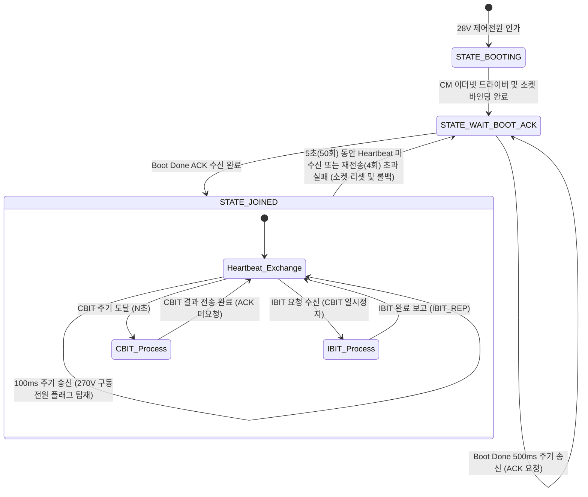

# 🌐 ATTLA_T CM 코어 이더넷 전환 및 W6100 공존 조사 보고서 (Research)

본 보고서는 **초장사정 자동선회잠금장치(ATTLA_T)** 프로젝트의 체계 이더넷 통신을 기존 W6100(CPU1 SPI 제어)에서 **동일 DSP(F28388D)의 CM(Connectivity Manager) 코어**와 물리 PHY 칩(DP83822)을 사용하는 구조로 전환하고, 기존 W6100은 모니터링용 이더넷으로 유지·공존시키기 위한 상세 기술 리포트입니다.

이식 대상인 테스터 프로젝트(`TMDSCNCD28388D_T`)와 현재 프로젝트(`ATTLA_T`)의 소스코드 및 아키텍처 분석 결과를 바탕으로 작성되었습니다.

---

## 1. 핵심 아키텍처 변경 및 공존 방안

현재 `ATTLA_T` 프로젝트는 **CPU1 단독 구동 + CLA 보조** 아키텍처로 설계되어 있어, CM 코어와 CPU2는 미사용(IPC 비활성화) 상태입니다. 체계 통신을 CM 코어로 이전하기 위해 다음과 같은 코어 간 역할 분담 및 공존 아키텍처를 적용합니다.

### 1.1 코어별 역할 정의
*   **CPU1 (Master Core)**:
    *   모터 구동 및 PID 제어 (100us 주기)
    *   센서 ADC 입력 폴링 및 CLA 보조 연산 제어
    *   W6100 모니터링용 이더넷 제어 (SPI-A 인터페이스 유지)
    *   시스템 전체 상태 머신 및 안전장치(BIT/Fault) 진단
    *   **CM 코어 클럭 공급, PHY 하드웨어 리셋 핀 제어, CM 코어 부팅 기동 담당**
*   **CM (Connectivity Manager Core, Cortex-M4)**:
    *   물리 PHY 칩(DP83822HFRHBT)을 사용한 MII 모드 이더넷 구동 (lwIP를 배제한 초경량 Raw UDP 통신)
    *   체계 연동통제안(ICD)에 따른 망 가입 상태 머신(`STATE_BOOTING` $\rightarrow$ `STATE_WAIT_BOOT_ACK` $\rightarrow$ `STATE_JOINED`) 및 Heartbeat(100ms 주기) 자발적 송수신 처리
    *   체계(PC)의 ARP Request에 대한 실시간 ARP Reply 자동 응답
    *   **MSGRAM(Message RAM)을 활용하여 CPU1과 양방향 제어 데이터 교환**

---

## 2. W6100 (모니터링용) 및 CM 이더넷 (체계용) 네트워크 분리안

W6100과 CM 코어 이더넷이 동일한 물리 네트워크 망에 공존할 때, IP 주소 및 포트 충돌을 피하기 위해 다음과 같이 설정을 분리해야 합니다.

> [!IMPORTANT]
> **네트워크 설정 이원화 검토**
> *   **체계 통신용 (CM 코어 + DP83822)**:
>     *   **IP 주소**: `192.168.200.10` (기존 체계 스펙 고정)
>     *   **포트 번호**: 수신/송신 `5001`
>     *   **MAC 주소**: `A8:63:F2:00:38:88`
> *   **모니터링용 (CPU1 + W6100)**:
>     *   **IP 주소**: `192.168.200.11` (IP 대역을 다르게 변경하여 충돌 회피)
>     *   **포트 번호**: 수신/송신 `5002` (또는 easyDSP 모니터링 규격 준수)
>     *   **MAC 주소**: `00:08:DC:11:22:33`

---

## 3. 하드웨어 및 GPIO 인터페이스 설계 (TBD 강조)

PHY 칩인 **DP83822HFRHBT**와 DSP 간의 **MII(Media Independent Interface)** 연결 및 제어용 GPIO 매핑 설계입니다. 현재 회로 사양이 미정(TBD)이므로 이식 시 아래의 매핑 코드에는 **TBD 강조 주석**을 표기하고, 추후 확정 시 즉각 수정할 수 있도록 구조화합니다.

```c
/* ==========================================================================
 * [TBD] 이더넷 PHY 칩(DP83822) MII 핀 매핑 정보 (회로도 미정으로 임시 할당)
 * ⚠️ 추후 회로 설계 확정 시 아래 GPIO 번호와 MUX 설정을 반드시 변경해야 합니다.
 * ========================================================================== */
#define ENET_PHY_RESET_GPIO       119U  /* TBD: PHY 하드웨어 리셋 (Active-Low) */
#define ENET_PHY_PWDN_INT_GPIO    108U  /* TBD: PHY Power Down / Interrupt (입력) */

/* MII 통신 전용 핀 설정 (TMDSCNCD28388D 컨트롤 카드 기준 예시) */
#define MII_TX_CLK_GPIO            44U  /* TBD */
#define MII_TX_EN_GPIO            118U  /* TBD */
#define MII_TX_D0_GPIO             75U  /* TBD */
#define MII_TX_D1_GPIO            122U  /* TBD */
#define MII_TX_D2_GPIO            123U  /* TBD */
#define MII_TX_D3_GPIO            124U  /* TBD */

#define MII_RX_CLK_GPIO           111U  /* TBD */
#define MII_RX_DV_GPIO            112U  /* TBD */
#define MII_RX_ERR_GPIO           113U  /* TBD */
#define MII_RX_D0_GPIO            114U  /* TBD */
#define MII_RX_D1_GPIO            115U  /* TBD */
#define MII_RX_D2_GPIO            116U  /* TBD */
#define MII_RX_D3_GPIO            117U  /* TBD */

#define MII_MDC_CLK_GPIO          105U  /* TBD: 관리 인터페이스 클럭 */
#define MII_MDIO_DATA_GPIO        106U  /* TBD: 관리 인터페이스 데이터 */
#define MII_CRS_GPIO              109U  /* TBD: Carrier Sense */
#define MII_COL_GPIO              110U  /* TBD: Collision Detect */
```

### 3.1 PHY 입력 클럭 및 전원 인가 제어
*   **PHY 입력 클럭 (25 MHz)**:
    *   외부 25MHz 오실레이터가 PHY 입력 클럭으로 인가되며, DSP의 ENETCLKOUT을 통해 동기화된 클럭을 내보낼 경우 CPU1 초기화(`initEmacGpioPins()`)에서 `SysCtl_setEnetClk(SYSCTL_ENETCLKOUT_DIV_2, SYSCTL_SOURCE_SYSPLL)` 설정을 수행하여 내부 PLL(200MHz)로부터 100MHz 또는 분주 클럭을 EMAC 모듈에 안정적으로 인가합니다.
*   **PHY 하드웨어 리셋 제어**:
    *   MII 통신 핀 셋업 후, 리셋 핀(`ENET_PHY_RESET_GPIO`)을 0(Active-Low 리셋)으로 드라이브하여 최소 10ms 이상 대기한 뒤 1로 전환하여 PHY 칩을 안정적으로 기상시킵니다.
    *   이때 아이솔레이터(`HX188NL`)를 거친 차동 신호 라인이 외부 체계 인터페이스 단자와 확실히 분리되도록 물리 리셋 시퀀스 타이밍을 보장해야 합니다.

---

## 4. MSGRAM & Seqlock 기반 Lock-Free IPC 통신 구조

C28x DSP 코어(16비트 워드 주소 체계)와 CM 코어(32비트 바이트 주소 체계) 간의 안전하고 빠른 데이터 동기화를 위해 **MSGRAM(Message RAM)** 영역에 메모리를 매핑하고, 세마포어나 뮤텍스 없이도 데이터 일관성을 지키는 **Seqlock (Sequence Lock)** 기법을 이식합니다.

### 4.1 메모리 맵핑 정보 (양방향 분리)
*   **CPU1 $\rightarrow$ CM 통신 버퍼 (`pxDataCpu1ToCm`)**:
    *   CPU1 뷰 주소: `0x39000U`
    *   CM 뷰 주소: `0x20080000U`
*   **CM $\rightarrow$ CPU1 통신 버퍼 (`pxDataCmToCpu1`)**:
    *   CPU1 뷰 주소: `0x38000U`
    *   CM 뷰 주소: `0x20082000U`

### 4.2 Seqlock 동기화 메커니즘
공유 구조체에 `seqCount` 변수를 추가하여 쓰기 시작 시 홀수로 증가시키고, 완료 시 짝수로 증가시킵니다. 읽는 코어는 읽기 전후의 `seqCount`가 동일하고 짝수인지 루프 검증하여 데이터가 중간에 오염되는 것을 완벽히 차단합니다. (ARM과 C28x 아키텍처 특성 대응)

```c
// Lock-Free IPC 데이터 교환 구조체 정의
typedef struct {
    uint32_t seqCount;      // Seqlock 카운터 (짝수: 완료, 홀수: 쓰기 진행중)
    uint32_t Command;       // 명령 코드 (예: IPC_CMD_CPU1_ETH_TX_DATA 등)
    uint32_t Status;        // 상태 플래그
    uint32_t Address;       // 확장 예비 필드
    union {
        uint32_t PayloadRaw[16];
        struct {
            float32_t waveValue;       // CPU1이 계산한 실시간 제어량/위치값
            float32_t adcTemperature;  // CPU1 보드 센싱 온도값
            uint32_t sequenceNum;     // 통신 동기화용 시퀀스 넘버
        } TxData;
        struct {
            uint32_t seqNum;          // 체계에서 수신한 시퀀스 넘버
            uint32_t waveType;        // 체계에서 수신한 동작 모드/파형 설정
        } RxData;
    } Payload;
} stIpcDataPacket;
```

---

## 5. 체계 이더넷 연동통제안 및 아키텍처 요구사항 (ICD) 연동

이식 후 CM 코어에서 구동할 상태 머신은 기존 `ATTLA_T_Ethernet_Specification.md`에 명시된 규칙을 100% 만족하도록 이식합니다.



---

## 6. 구현 상세 단계 (Plan 작성을 위한 단계 구분)

사용자의 명시적 승인 후 구현을 개시할 때 진행할 태스크 구조입니다.

1.  **CM 코어 프로젝트 (`ATTLA_T_CM`) 신규 신설**:
    *   CCS Workspace 내에 TMS320F28388D CM 코어(Cortex-M4F) 대상의 신규 빌드 프로젝트를 생성합니다.
    *   TI Clang 컴파일러 표준에 부합하도록 컴파일 옵션 및 링커 커맨드 파일(`.cmd`)을 배치합니다.
2.  **CM 이더넷 및 타이머 드라이버 이식**:
    *   `hal_Ethernet.c`, `hal_Ethernet.h` (DP83822 MII 제어, 인터럽트 핸들러 `isr_EmacRx0` 등록)
    *   `hal_Timer.c`, `hal_Timer.h` (1ms 카운터용 타이머)
3.  **CM 이더넷 프로토콜(ICD) 및 IPC 이식**:
    *   `csu_Ethernet.c`, `csu_Ethernet.h` (Raw 이더넷/IP/UDP 패킷 수동 조립 및 ARP 자동 응답기 구현)
    *   `csu_Ipc_cm.c`, `csu_Ipc_cm.h` / `hal_Ipc_cm.c`, `hal_Ipc_cm.h` (MSGRAM 맵핑 및 CPU1 핸드셰이크)
4.  **CPU1 코어 기동 및 동기화 구현**:
    *   `hal_DspInit.c` 내에 `initEmacGpioPins()` (PHY GPIO 셋업 - TBD 주석 처리) 및 `Initial_CmCore()` (CM 코어 AuxPLL 클럭 설정 및 부팅) 추가
    *   `main.c`에 CM 코어 기동을 대기하는 `while (xIpcState.isCmReady == false)` 대기 루프 및 IPC 동기화 로직 가동
    *   W6100 드라이버의 IP/포트 변경 및 100ms 상태 머신 이관에 따른 기존 W6100 체계 통신 로직 정리
5.  **정적 신뢰성 분석 및 보안성 검증 (DAPA SCR-G, CWE-658 등)**:
    *   함수 매개변수 개수 제한(8개 이하), 단일 Exit Point 준수, Null Pointer Dereference 방지용 포인터 사전 검증 로직 전면 검토.

---

## 7. 사용자 확인 및 검토 필요 사항

> [!WARNING]
> **W6100과 CM 이더넷 공존을 위한 추가 검토 필요 사항**
> 1.  **W6100의 변경할 IP 대역 및 포트 번호 확정**:
>     *   현재 CM 코어 이더넷이 체계 통신 스펙(`192.168.200.10`, 포트 `5001`)을 그대로 상속받을 예정입니다.
>     *   이에 따라 W6100 모니터링 이더넷에 새롭게 할당할 IP(예: `192.168.200.11`)와 포트 번호(예: `5002`)의 적정성을 검토해 주시기 바랍니다.
> 2.  **CM 코어 CCS 프로젝트 생성 방식**:
>     *   현재 작업 폴더에는 CPU1 프로젝트만 존재합니다. CM 코어용 프로젝트 폴더를 새로 추가하고 소스코드를 작성하기 위해 준비하겠습니다.

---
*본 조사는 사용자 전용 Rule(user_global 및 GEMINI.md)에 의거하여 소스코드 무단 덮어쓰기를 원천 방지하고 정적 시험 및 CM 아키텍처 특성을 사전에 준수할 수 있도록 완료되었습니다. 사용자가 계획(Plan) 수립 및 구현 개시를 명시적으로 지시할 때까지 코드 수정은 보류됩니다.*
